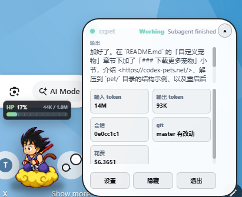
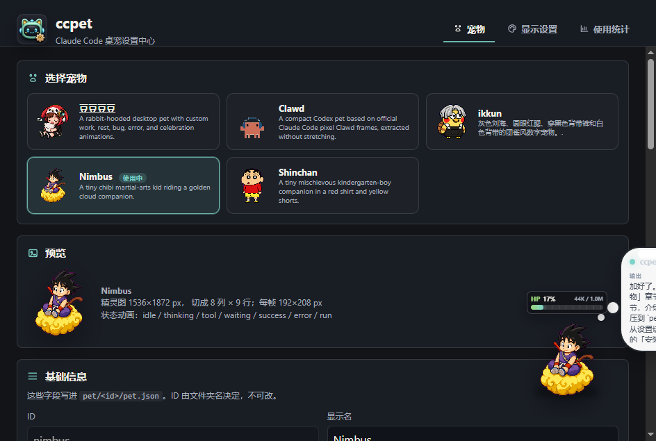
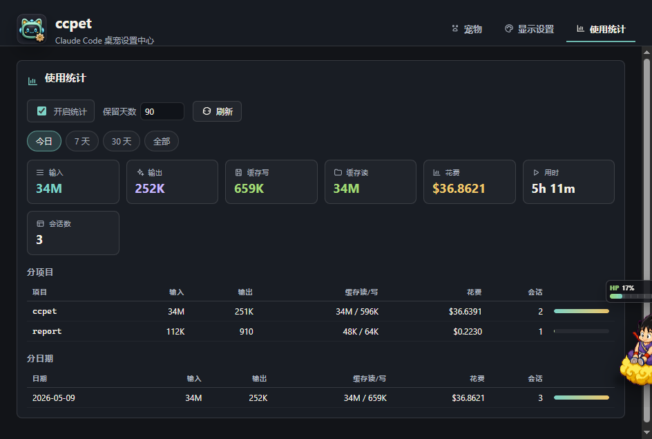

# ClaudePet

Claude Code 桌面宠物。通过 Claude Code 的 `statusLine` 和 `hooks` 把会话状态、上下文用量、git 状态、token 消耗、任务进度、需要注意的提示等显示在一个 Electron 小窗口里。支持 Windows / macOS / Linux。

---

## 截图

**桌面常驻窗口** — 桌宠 + HP 条 + 气泡输出


**展开面板** — 实时 token、会话 ID、git 状态、本次花费等



**设置中心 · 宠物** — 切换、预览、可视化编辑 manifest



**设置中心 · 使用统计** — 按今日 / 7 天 / 30 天 / 全部，分项目和分日期的 token / 花费汇总



---

## 前置要求

- Node.js 18+（Electron 42 要求）
- Claude Code（CLI / Desktop / IDE 扩展任一）

---

## 下载与安装

有两种方式拿到 ClaudePet：

### 方式 A：从 GitHub 克隆

```bash
git clone https://github.com/liuchenlili/ClaudePet.git
cd ClaudePet
npm install
```

### 方式 B：下载发布包

从 GitHub Releases 下载 ZIP，解压后进入 ClaudePet 目录：

```bash
cd <ClaudePet>
npm install
```

`npm install` 只把依赖（主要是 `electron`）装到当前 `node_modules`，**不做任何全局安装**。

> ⚠️ **不要装完后移动 ClaudePet 目录** — 集成时会把 ClaudePet 的绝对路径写进 Claude Code 的 `settings.json`，目录搬走了就失效，需要重新 install。

记下当前 ClaudePet 路径，下文用 `<ClaudePet>` 占位（例：`D:\code\ClaudePet` 或 `~/code/ClaudePet`）。

---

## 验证桌宠能独立启动

```bash
npm start
```

应该看到桌宠窗口出现在屏幕上。从系统托盘 → 退出 关掉即可。
此时尚未与 Claude Code 集成，状态不会变化。

---

## 与 Claude Code 集成（三选一）

### 方案 A：全局生效（推荐）

所有项目都会自动唤起桌宠。

```bash
cd <ClaudePet>
npm run install:user
```

写入 `~/.claude/settings.json`（Windows 是 `%USERPROFILE%\.claude\settings.json`），原文件会被备份成 `settings.json.claudepet-backup-<时间戳>`。

### 方案 B：仅 ClaudePet 项目自身使用

```bash
cd <ClaudePet>
npm run install:local
```

写入 `<ClaudePet>/.claude/settings.local.json`，只对 ClaudePet 仓库本身生效。

### 方案 C：只让某个其他项目使用

进到目标项目，调用 ClaudePet 的绝对路径：

```bash
cd <你的目标项目>
node D:\coding\ClaudePet\bin\claudepet.js install --scope local --preserve-statusline
# D:\coding\ClaudePet 替换为你本机的 ClaudePet 仓库路径
```

写入目标项目的 `.claude/settings.local.json`（git 默认忽略，不会污染团队配置）。

> ⚠️ **不要直接** `npm run install:local`：那条命令的 cwd 是 ClaudePet 仓库自己（`src/cli.js:177`），会装错地方。

---

## 启动桌宠

集成后，桌宠会在 Claude Code 第一次触发 statusLine 或 hook 时**自动 spawn**，无需手动启动。

也可以提前打开：

```bash
cd <ClaudePet>
npm start
```

桌宠主进程是**单实例**的（`app.requestSingleInstanceLock()`），但**每个 Claude Code 会话拥有自己独立的宠物窗口**——多个终端同时开 Claude Code 不会再互相抢同一只宠物。详见下文「多会话与生命周期」。

---

## 常用命令

```bash
node <ClaudePet>/bin/claudepet.js doctor       # 显示 home、runtime 端口、Electron 路径、可用宠物
node <ClaudePet>/bin/claudepet.js pets         # 列出可用宠物
node <ClaudePet>/bin/claudepet.js start        # 等同 npm start
node <ClaudePet>/bin/claudepet.js --help       # 全部命令
```

PowerShell 用户可以加个简写。在 `$PROFILE` 里：

```powershell
function claudepet { node D:\path\to\ClaudePet\bin\claudepet.js @args }
```

之后直接 `claudepet doctor`、`claudepet install --scope local` 等。

---

## 卸载

```bash
cd <ClaudePet>
npm run uninstall:user      # 移除全局集成
npm run uninstall:local     # 移除 ClaudePet 自身项目的集成
```

卸载某个目标项目：

```bash
cd <你的目标项目>
node <ClaudePet>/bin/claudepet.js uninstall --scope local
```

卸载会从 settings.json 中移除 ClaudePet 注入的 statusLine 和 hooks，并尽可能恢复原 statusLine（如果安装时 `--preserve-statusline` 保存过）。备份文件保留在原位置不会自动删。

完全清除：再删除 `~/.claudepet/` 目录和那些 `*.claudepet-backup-*` 备份即可。

---

## 故障排查

| 现象 | 检查 |
|---|---|
| 桌宠不出现 | `claudepet doctor` 看 `runtime` 字段；显示 `not running` 就 `npm start` 手动启动 |
| statusLine 没变化 | 看 `~/.claude/settings.json` 的 `statusLine.command` 是否包含 `claudepet.js`，被其他工具覆盖了就重装 |
| 状态长时间停在 idle | hook 没装齐。settings 的 `hooks` 块应该有 14 个事件每个都含 claudepet 条目，重装即可 |
| 改了 ClaudePet 目录位置 | 路径是写死的，搬动后必须重新 install |
| 同时开了 N 个 Claude，宠物数对不上 | 同 cwd 的会话会共用一只宠物（避免 `/clear` 后多出窗口）；要分开就在不同目录跑或等 5 分钟以上 |
| 关了 Claude 终端但宠物还在 | 等 15 分钟内会自动收掉；想立刻关，右键宠物 → 关闭此宠物 |
| 启动时跳出一堆历史宠物 | 已修复，启动只 hydrate 状态不再自建窗口；旧版若仍出现，删 `~/.claudepet/state.json` 即可 |
| state.json 损坏导致宠物消失 | 已加原子写 + 自动隔离损坏文件（移到 `state.json.corrupt-<时间戳>`），重启即可 |

---

## 集成做了什么（深入了解）

`install --scope user` 等价于：

1. 备份 `~/.claude/settings.json` → `settings.json.claudepet-backup-<时间戳>`
2. 把原 `statusLine`（若不是 ClaudePet）保存为 ClaudePet 的 `legacyStatusLine`，桌宠收到 statusLine 时会代为转发它的输出
3. 改写 `statusLine.command` 为 `node <ClaudePet>/bin/claudepet.js statusline`
4. 给以下 14 个 hook 各追加一条 `node <ClaudePet>/bin/claudepet.js hook` 命令（如尚未存在）：
   ```
   UserPromptSubmit, PermissionRequest, Notification,
   PreToolUse, PostToolUse, PostToolUseFailure, PostToolBatch,
   SubagentStart, SubagentStop, TaskCreated, TaskCompleted,
   Stop, StopFailure, PreCompact, PostCompact
   ```
   全部 `async: true; timeout: 5`，不会阻塞 Claude Code。
5. ClaudePet 自己的配置存在 `~/.claudepet/`（`config.json` / `state.json` / `runtime.json`），可用环境变量 `CLAUDEPET_HOME`、`CLAUDE_HOME` 自定义。

---

## 自定义宠物

`pet/<id>/` 目录下放：

- `pet.json`（manifest）
- `spritesheet.webp`

manifest 支持 `frameWidth`、`frameHeight`、`columns`、`rows`、`defaultScale`、`anchor`，以及七种动画：`idle`、`thinking`、`tool`、`waiting`、`success`、`error`、`run`。

桌宠系统托盘 → 打开设置 可视化编辑、切换宠物。内置三只宠物 `ikkun` / `clawd` / `nimbus` 的 spritesheet 是 `1536x1872`，按 `192x208` 帧 `8x9` 网格切分。

### 下载更多宠物

到 <https://codex-pets.net/> 选喜欢的宠物，下载得到一个 ZIP（里面是一个含 `pet.json` 和 `spritesheet.webp` 的文件夹）。

直接解压到 ClaudePet 的 `pet/` 目录下：

```text
<ClaudePet>/
  pet/
    <下载的宠物文件夹>/
      pet.json
      spritesheet.webp
```

然后重启 ClaudePet，托盘 → 打开设置 → 「宠物」页面就能看到并切换。

### 安装别人分享的 Pet

别人分享 Pet 时，通常会给你一个文件夹或 ZIP。确认解压后结构类似：

```text
your-pet/
  pet.json
  spritesheet.webp
```

把整个 `your-pet/` 文件夹放到 ClaudePet 的 `pet/` 目录下：

```text
<ClaudePet>/
  pet/
    your-pet/
      pet.json
      spritesheet.webp
```

然后重启 ClaudePet，或从托盘打开设置，在「宠物」页选择新 Pet。

### 分享自己的 Pet

只需要打包 `pet/<id>/` 这个单独文件夹。文件夹名就是 Pet 的唯一 ID；`pet.json` 里的 `spritesheetPath` 默认指向同目录下的 `spritesheet.webp`。

---

## 桌宠展示什么

- **上下文容量**：使用百分比、窗口大小、实时 token
- **会话**：id、cwd、模型、Claude Code 版本、花费、用时
- **token**：实时 input/output、来自 transcript 的整 session 累计
- **git**：分支、dirty/staged/untracked/ahead/behind
- **任务状态**：idle、thinking、running tool、waiting permission、waiting input、subagent running、task created/completed、completed、error、compacting

权限请求、输入提示等需要"注意"的状态会高亮气泡并触发系统通知。

---

## 开发与测试

```bash
npm test         # 运行所有测试
npm run dev      # Electron 开发模式
```

测试覆盖 install/uninstall、状态机、宠物 manifest、transcript 解析等。

---

## 上线前功能审查

发布前建议按这张清单走一遍：

- 准备 GitHub Releases 下载包（仓库：<https://github.com/liuchenlili/ClaudePet>）。
- `npm install` 后运行 `npm test`，确认 install/uninstall、状态机、宠物 manifest、transcript 解析都通过。
- 运行 `npm start`，检查桌宠窗口、托盘菜单、设置中心「宠物 / 显示设置 / 使用统计」三个页签。
- 运行 `node bin/claudepet.js doctor` 和 `node bin/claudepet.js pets`，确认 runtime、Electron 路径和内置宠物都可读。
- 测试 `npm run install:user` 或 `npm run install:local`，确认 Claude Code 的 `statusLine` 和 14 个 hooks 写入成功。
- 把一个外部 Pet 文件夹复制到 `pet/<id>/`，重启后确认能在设置中心选择并播放七种动画。
- 测试权限请求、等待输入、工具失败、Stop 完成等状态，确认气泡高亮、系统通知和动画切换符合预期。

---

## 多会话与生命周期

### 一会话一宠物
每个 Claude Code 会话（`session_id`）有自己独立的桌宠窗口。多个终端同时开 Claude Code 会看到多只宠物，状态、形象、位置、消息框开关都互不影响。

### 右键单只宠物可设置
右键宠物窗口能：
- **切换形象**（横向缩略图，仅改变此宠物）
- **隐藏 / 显示消息框**（每只独立的气泡开关）
- **打开设置中心**
- **隐藏**（只隐藏这只）
- **关闭此宠物**（结束这只，不影响其他会话）
- **退出 ClaudePet**（关掉整个 app，所有宠物一起退）

### `/clear` 不会多出宠物
Claude Code 的 `/clear` 会启动新的 `session_id`。当新 session 的事件到达且 cwd 与最近 5 分钟内活跃的旧 session 相同，ClaudePet 会把那只宠物的窗口/状态/位置/形象**整体接管**到新 session，而不是另开一个窗口。

### 自动收尾
- Claude Code 发 `SessionEnd` 钩子时，立即销毁对应宠物。
- 没收到 `SessionEnd` 也没事——超过 **15 分钟无事件** 的 session 会被后台任务（每分钟扫一次）清理掉。
- 启动 ClaudePet 时不会再自动复活历史宠物：只在收到真实事件后才弹窗。

### 暗 / 亮主题
设置中心 → 显示设置 顶部有「暗色 / 亮色」切换，立即对所有桌宠窗口和管理器生效。配置存在 `config.theme`。

### 并发写入安全
所有 `~/.claudepet/*.json` 写入都走"临时文件 + 原子 rename"，多个 CLI 进程并发触发 statusline 不再可能把 `state.json` 写花。万一文件损坏，启动时会被自动隔离成 `*.corrupt-<时间戳>` 而不会让主进程崩。

---

## 更新日志

### 2026-05-12
- **修复**：管理器顶栏在亮色主题下仍是暗色（写死的 hex 改成走 CSS 变量）。
- **修复**：启动 Claude Code 时会一下子弹出一堆历史宠物——启动不再自动复活磁盘里的旧 session，并把过期记录提前清理。
- **新增**：`/clear` 自动把旧宠物接管到新 session，避免多出窗口。
- **新增**：识别 `SessionEnd` 钩子，立即关掉对应宠物。
- **调优**：不活跃 session 的清理阈值从 1 小时缩到 15 分钟，扫描间隔从 5 分钟缩到 1 分钟。

### 2026-05-11
- **新增**：暗 / 亮主题切换（设置中心 → 显示设置）。
- **新增**：右键菜单加「隐藏 / 显示消息框」（每只宠物独立）。
- **新增**：每只宠物可独立切换形象（右键菜单顶部的横向缩略图）。
- **新增**：每个 Claude Code 会话独立的桌宠窗口；位置、形象、消息框可见性都按会话保存。
- **修复**：右键菜单按钮点击经常失效——菜单打开期间锁定鼠标穿透为关闭。
- **修复**：多个终端并发写 `state.json` 导致 JSON 损坏、主进程崩——所有 JSON 写入改为原子 rename + 自动隔离损坏文件。
- **修复**：右键菜单加了形象选择后底部按钮被挤出窗口——菜单加滚动兜底，按钮放上方。
- **新增**：托盘菜单改为"显示全部 / 隐藏全部 / 设置 / 退出"。

---

## 致谢

- 感谢 [linux.do](https://linux.do/) 社区在开发过程中提供的反馈、讨论和灵感。
- 感谢 [Claude Code](https://claude.com/claude-code) —— 整套 statusLine / hooks 体系是 ClaudePet 能存在的前提,大量代码也是在 Claude Code 协助下完成的。

---

## License

MIT
